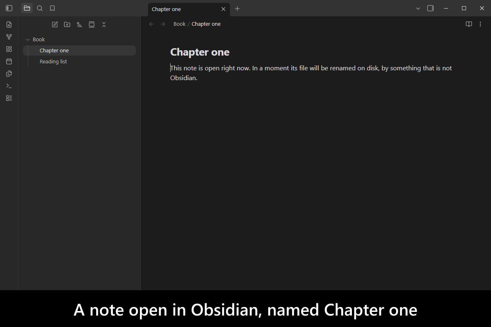
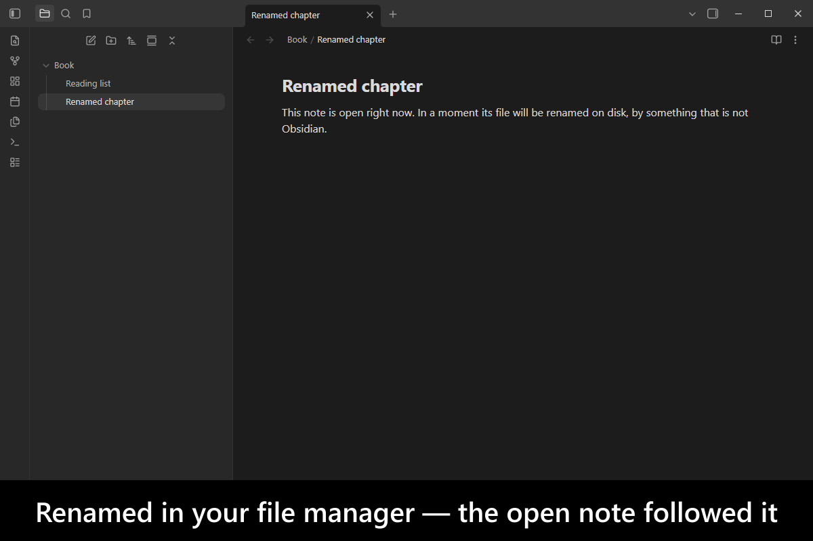

# External Rename Handler

[](https://www.buymeacoffee.com/mnaoumov) [](https://github.com/mnaoumov/obsidian-external-rename-handler/releases) [](https://github.com/mnaoumov/obsidian-external-rename-handler/releases) [](https://github.com/mnaoumov/obsidian-external-rename-handler)

Rename a note inside [Obsidian](https://obsidian.md/) and every link to it is updated. Rename the same file in your file manager, from a script, or through a sync client, and Obsidian sees a delete followed by a create — so the links are not updated, and every note that pointed at it is left pointing at nothing.

This plugin recognizes those external renames for what they are and treats them as a single rename, so links survive a change made outside the app.

> [!WARNING]
>
> The plugin works only if Obsidian is running during the external renames.
>
> The plugin only handles renames for those files/folders that Obsidian tracks.
>
> The plugin only handles renames made inside the vault.
>
> The plugin doesn't handle the renames made outside of the vault even if the renamed files are referenced within the vault.
>
> The plugin doesn't handle the renames in files/folders that start with `.` (dot).

<!-- markdownlint-disable MD033 -->

<a href="https://github.com/mnaoumov/obsidian-external-rename-handler/blob/HEAD/images/screenshots/screenshot-desktop-1.png"></a>

<details>
<summary>More screenshots</summary>

<a href="https://github.com/mnaoumov/obsidian-external-rename-handler/blob/HEAD/images/screenshots/screenshot-desktop-2.png"></a>

</details>

<!-- markdownlint-enable MD033 -->

## Demo vault

**The documentation is a demo vault.** Every feature has a note that explains what it does and why you would want it, with a note ready to rename and backlinks ready to watch.

**[Start reading here](<./demo-vault/00 Start.md>)** — it is plain markdown, so it works on GitHub with nothing installed.

A copy of the vault ships with every release. You can access it via any of the following:

1. Running the **External Rename Handler: Open demo vault** command.
2. Downloading `external-rename-handler-demo-vault-<version>.zip` (`<version>` is the release version) from the [Releases](https://github.com/mnaoumov/obsidian-external-rename-handler/releases).
3. Browsing its source in [`demo-vault/`](./demo-vault/README.md) in this repository.

## What it does

- **A rename made outside Obsidian updates links**, instead of arriving as an unrelated delete and create. [01 External renames](<./demo-vault/01 External renames.md>)
- **Moving a file, and moving whole folders**, are handled the same way. [02 Moving and folders](<./demo-vault/02 Moving and folders.md>)
- **How the detection works**, and therefore where its limits are — worth reading before trusting it with anything irreversible. [03 How it works](<./demo-vault/03 How it works.md>)
- **Every setting**, by the key it is stored under. [04 Settings](<./demo-vault/04 Settings.md>)

## Installation

The plugin is available in [the official Community Plugins repository](https://obsidian.md/plugins?id=external-rename-handler).

### Beta versions

To install the latest beta release of this plugin (regardless if it is available in [the official Community Plugins repository](https://obsidian.md/plugins) or not), follow these steps:

1. Ensure you have the [BRAT plugin](https://obsidian.md/plugins?id=obsidian42-brat) installed and enabled.
2. Click [Install via BRAT](https://intradeus.github.io/http-protocol-redirector?r=obsidian://brat?plugin=https://github.com/mnaoumov/obsidian-external-rename-handler).
3. An Obsidian pop-up window should appear. In the window, click the `Add plugin` button once and wait a few seconds for the plugin to install.

## Debugging

By default, debug messages for this plugin are hidden.

To show them, run the following command:

```js
window.DEBUG.enable('external-rename-handler');
```

For more details, refer to the [documentation](https://mnaoumov.dev/obsidian-dev-utils/guides/debugging/).

## Changelog

All notable changes to this project will be documented in the [CHANGELOG](./CHANGELOG.md).

## Contributing

Contributions are welcome — see [CONTRIBUTING](./CONTRIBUTING.md) to get set up.

## Support

<!-- markdownlint-disable MD033 -->

<a href="https://www.buymeacoffee.com/mnaoumov" target="_blank"></a>

<!-- markdownlint-enable MD033 -->

## My other Obsidian resources

[See my other Obsidian resources](https://github.com/mnaoumov/obsidian-resources).

## License

© [Michael Naumov](https://github.com/mnaoumov/)
